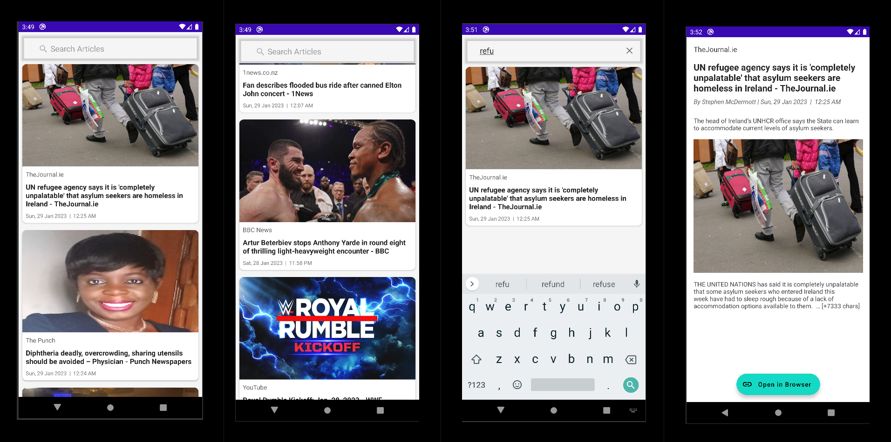

# Project Overview
- A simple news app, built with the free [newsapi.org API](https://newsapi.org)

## Requirements

- Android Studio.
- Java JDK.
- Android SDK.
- [newsapi.org](https://newsapi.org) API Key.

## How to build and run

1. First clone the repo on any location of your choice on your laptop, you can execute the following command to clone it ` git clone https://github.com/RofaeilAshaiaa/SimpleNewsApp` in the _terminal/command_ line on Linux/Mac or in your _bash shell/git bash_ on Windows.

2. You'll need an API key from the free [News API](https://newsapi.org) to be able to build and run the app. So, if you don't have an API key, go to the website and signup to get an API key.

3. Assuming you have an API, open the project in the file manager of your operating system and navigate to `values` folder (which you will find by navigating through SimpleNewsApp-> app->src->main->res->values). You'll need to create a resource files with your API key. Create a new file called `secrets.xml` and paste the following content and replace the value of `news_api_key` with your API key:
    ```
    <?xml version="1.0" encoding="utf-8"?>
    <resources>
       <string name="news_api_key">put_your_api_key_here</string>
    </resources>
    ```
4. Finally, Open Android Studio and import the project you have cloned then you can let android studio pull the required dependencies and wait until the build finishes then you can deploy the app to an emulator or any connected device. 


## Points to improve

- Use Room library to implement an offline cache so the app still can display list of old news articles instead of empty screen.
- Add the pagination functionality in the articles screen which we can achive using Pagging 3 library.
- Add unit tests for the repos.
- Complete the unit tests for the view model.
- Add UI tests for both article list and article details screen.

## Important Note
- Due to the time limit, the unit test are not full completed and the UI tests are missing.
- I could have implemented the UI in jetpack compose since I have some experience using it in some apps. For a recent project I have developed using Compose check [the Weather App](https://github.com/RofaeilAshaiaa/SimpleWeatherApp).

# App Demo on Emulator

- You can view a demo video for the app running under the `screenshot/` folder in the root directory of the project.